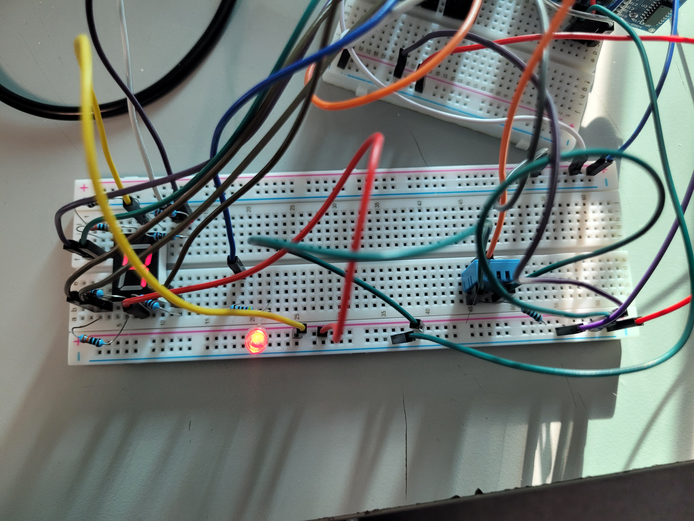

# Entrega Final

En el siguiente reporte se explican los detalles de la entrega final de la Semana I, esta consiste en un sistema con el ESP32, el cual realiza mediciones de tres variables fisicas para posteriormente mandar los datos a una base de datos en Firebase, asimismo toma los datos de dos variables en Firebase, para cambiar la señal de un PWM, y mandar un digito en un display de 7 segmentos. A partir de esta base de datos, una aplicación de app inventor tomarán los datos almacenados para mostrar las distintas mediciones, tambien podrá mandar datos diferentes para cambiar el valor del PWM y mostrar un digito diferente en el display

**Conexiones con el ESP32**

Para medir las variables fisicas se utilizarón los siguientes sensores:

- Sensor PIR de movimiento
- Sensor DHT11 de temperatura y humedad
- Sensor HC-SR04 de distancia 

Para este proyectto las variables fisicas a medir fueron:

- Movimiento (True o False)
- Humedad (Porcentaje de humedad)
- Distancia (en cm)

En el siguiente diagrama se muestran las conexiones realizadas con el ESP32

